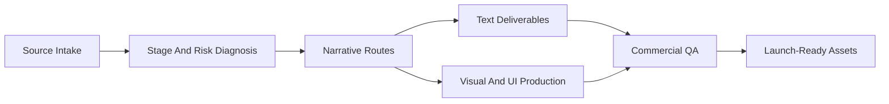
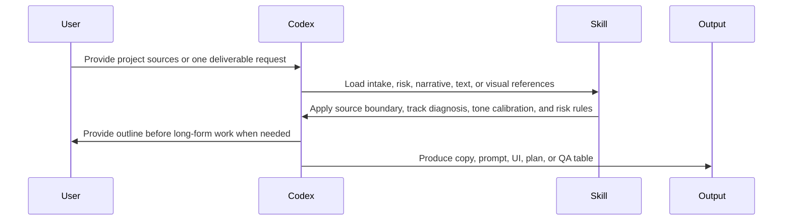
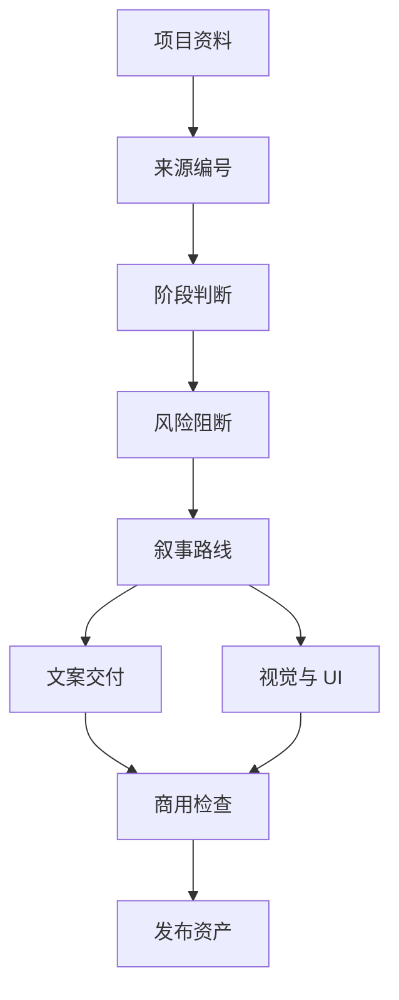

# Web3 Brand Workflow

[English](#english) | [中文](#中文)

A commercial-grade Codex Skill for Web3 brand narrative, public communication, launch content, visual prompt systems, AI image direction, website UI, DApp UI, app UI, and production governance.



---

## English

### What This Is

Web3 Brand Workflow is a Codex Skill for teams that need to turn raw Web3 project materials into launch-ready brand and communication assets.

It helps an AI agent inspect source files, identify the project stage, separate public facts from internal-only material, build a brand narrative, block risky Web3 claims, and produce deliverables across strategy, copywriting, visual direction, UI, and launch operations.

It is designed for real Web3 production work, including:

- protocol, infrastructure, L1, L2, and developer-tool narratives
- DeFi, DEX, liquidity, RWA, DAO, SocialFi, NFT, GameFi, and Web3 SaaS projects
- whitepapers, manifestos, landing pages, X threads, Medium articles, community scripts, AMA plans, GTM plans, launch calendars, pitch structures, posters, long images, IP mascot prompts, website UI, DApp UI, and app UI
- full-case brand incubation or single-module intervention when a team only needs one asset

### Confidentiality First

This public repository contains anonymized calibration patterns only.

It does not include client names, local source paths, unreleased project facts, partner names, funding details, private screenshots, token mechanics, or internal working files.

When using this Skill on real client material, keep every public example anonymized unless the project owner has explicitly approved disclosure.

### Commercial Positioning

This Skill is not a generic Web3 copy generator. It is a production workflow for Web3 brand operators who need source discipline, risk control, narrative quality, and asset consistency.

It is built around five operating gates:

| Gate | Purpose |
| --- | --- |
| Source Boundary | Identify which facts can be used, which facts are internal, and which facts require owner confirmation. |
| Stage Accuracy | Prevent preparation-stage projects from being written as already live, open, funded, audited, or reward-bearing. |
| Narrative Fit | Match the brand route to the actual track, user action, proof level, and market context. |
| Visual Risk Control | Avoid fake financial visuals, unsupported partner walls, token promises, yield cues, and copied generic cyberpunk layouts. |
| Commercial QA | Check platform fit, readability, claim support, launch sequence, roles, resources, and KPI assumptions. |

### Anonymized Calibration Cases

The Skill was abstracted from three anonymized Web3 production patterns:

| Case | Track | Production Lesson |
| --- | --- | --- |
| Case Alpha | Web3 SaaS and campaign operations | Early-stage projects need official language, source-safe CTAs, and product clarity without pretending the product is fully live. |
| Case Beta | DeFi and liquidity infrastructure | Existing DeFi visuals can look strong while still carrying risky claims. Preserve the style, verify every mechanism. |
| Case Gamma | Original IP, GameFi, community, and merch ecosystem | Story assets and financial mechanisms must be separated. Public communication should lead with the stable story layer. |

### What It Produces

| Category | Deliverables |
| --- | --- |
| Strategy | brand diagnosis, positioning routes, narrative architecture, audience map, message house, launch sequence |
| Long-Form Text | whitepaper outline, public whitepaper draft, manifesto, Medium article, BP structure, GTM proposal |
| Social Content | X thread, X short post pack, founder post, community announcement, giveaway-safe copy, Discord and Telegram scripts |
| Live Operations | AMA outline, Q&A boundary, launch calendar, release checklist, owner confirmation list, KPI table |
| Visual Direction | VI anchor table, prompt base, poster prompt, long-image prompt, IP mascot prompt, roadmap visual prompt |
| UI Production | official website structure, landing page, DApp UI, mint page, dashboard, launch page, app UI direction |
| QA | risk word scan, claim support check, visual risk check, platform fit check, mobile readability check |

### Workflow Modes

| Mode | Use When | Output Behavior |
| --- | --- | --- |
| Full-Stack Mode | You need a full Web3 brand case from raw materials. | Build the source system first, then produce narrative, copy, visual, UI, and launch assets. |
| Plug-In Mode | You only need one part, such as an X thread, whitepaper outline, poster prompt, or UI direction. | Read the minimum source set, check risk and tone, then produce the requested asset. |

### Production Flow



### Repository Structure

```text
web3-brand-workflow/
├── README.md
├── LICENSE
├── SKILL.md
├── agents/
│   └── openai.yaml
├── references/
│   ├── confidentiality-and-public-release.md
│   ├── intake-risk-and-narrative.md
│   ├── source-project-patterns.md
│   ├── text-deliverables.md
│   └── visual-ui-production.md
└── scripts/
    └── scaffold_web3_brand_project.py
```

### Install

```bash
git clone https://github.com/midiansir/web3-brand-workflow.git
mkdir -p "${CODEX_HOME:-$HOME/.codex}/skills"
cp -R ./web3-brand-workflow "${CODEX_HOME:-$HOME/.codex}/skills/"
```

### Use

```text
Use $web3-brand-workflow to turn these Web3 project materials into a source-safe brand narrative, whitepaper outline, X launch pack, visual prompt pack, website UI direction, and launch QA checklist.
```

### Create A Project Skeleton

```bash
python scripts/scaffold_web3_brand_project.py "ProjectName" --output-root "/path/to/projects"
```

The script creates Day1 to Day4 working files, numbered deliverable folders, production tools, and archive folders for Web3 brand production.

### License

MIT License. See [LICENSE](LICENSE).

---

## 中文

### 这个仓库是什么

Web3 Brand Workflow 是一个 Codex Skill，用来把 Web3 项目原始资料整理成可以进入真实生产的品牌品宣工作流。

它会指导 AI Agent 先检查资料来源，判断项目阶段，区分可以公开的事实、只能内部使用的内容和需要负责人确认的信息，再进行品牌叙事、文案、视觉方向、UI 和发布计划生产。

它适合处理这些 Web3 生产场景：

- protocol、基础设施、L1、L2、开发者工具的品牌叙事
- DeFi、DEX、流动性、RWA、DAO、SocialFi、NFT、GameFi、Web3 SaaS 项目
- 白皮书、品牌宣言、官网文案、X 推文、Medium 文章、社群话术、AMA 方案、GTM 计划、发布日历、BP 结构、海报、长图、IP 形象提示词、官网 UI、DApp UI 和 App UI
- 从 0 到 1 的完整品宣全案，也可以中途介入只做某一个交付物

### 保密优先

这个公开仓库只保留匿名化后的方法和案例模式。

仓库中不包含客户名称、本地资料路径、未公开项目事实、合作方名称、融资信息、私有截图、代币机制和内部工作文件。

真实客户项目使用这个 Skill 时，所有公开示例都必须先匿名化，除非项目负责人明确允许公开披露。

### 商业定位

这个 Skill 不是普通的 Web3 文案生成器，而是给 Web3 品牌操盘手、创意团队和市场团队使用的生产工作流。

它围绕五个生产关口工作：

| 关口 | 作用 |
| --- | --- |
| 来源边界 | 判断哪些事实可以公开使用，哪些只能内部使用，哪些需要负责人确认。 |
| 阶段准确 | 防止把准备期项目写成已经上线、开放、融资、审计或有奖励。 |
| 叙事适配 | 根据赛道、用户动作、证据强度和市场语境选择品牌叙事方向。 |
| 视觉风险控制 | 避免虚假的金融视觉、未经确认的合作墙、代币承诺、收益暗示和套模板赛博风格。 |
| 商用检查 | 检查平台适配、可读性、事实依据、发布节奏、角色分工、资源和 KPI 假设。 |

### 匿名校准案例

这个 Skill 抽象自三个匿名化 Web3 品宣生产模式：

| 案例 | 赛道 | 生产经验 |
| --- | --- | --- |
| Case Alpha | Web3 SaaS 和活动运营工具 | 早期项目需要官方、稳健、清晰的表达，不能把准备阶段写成已经全面上线。 |
| Case Beta | DeFi 和流动性基础设施 | DeFi 视觉可以很强，但所有机制、收益、费用和规模表达都必须重新确认。 |
| Case Gamma | 原创 IP、GameFi、社区和周边生态 | 故事资产和金融机制要分开处理，公开传播优先使用更稳定的故事层。 |

### 它能产出什么

| 类别 | 交付物 |
| --- | --- |
| 策略 | 品牌诊断、定位方向、叙事架构、受众地图、信息屋、发布节奏 |
| 长文 | 白皮书大纲、对外白皮书正文、品牌宣言、Medium 文章、BP 结构、GTM 方案 |
| 社媒 | X Thread、X 短帖包、创始人帖、社区公告、合规抽奖文案、Discord 和 Telegram 话术 |
| 运营 | AMA 提纲、问答边界、发布日历、发布检查清单、负责人确认清单、KPI 表 |
| 视觉 | VI 锚点表、提示词基础设定、海报提示词、长图提示词、IP 形象提示词、路线图视觉提示词 |
| UI | 官网结构、Landing Page、DApp UI、Mint 页面、Dashboard、Launch Page、App UI 方向 |
| 检查 | 风险词扫描、事实依据检查、视觉风险检查、平台适配检查、移动端可读性检查 |

### 工作模式

| 模式 | 使用场景 | 输出方式 |
| --- | --- | --- |
| 全案模式 | 从原始资料开始做完整 Web3 品宣全案。 | 先建立来源系统，再生产叙事、文案、视觉、UI 和发布资产。 |
| 单点模式 | 只需要一条 X Thread、一个白皮书大纲、一组海报提示词或一个 UI 方向。 | 读取最小资料集合，检查风险和调性，然后直接生产指定交付物。 |

### 生产流程



### 目录结构

```text
web3-brand-workflow/
├── README.md
├── LICENSE
├── SKILL.md
├── agents/
│   └── openai.yaml
├── references/
│   ├── confidentiality-and-public-release.md
│   ├── intake-risk-and-narrative.md
│   ├── source-project-patterns.md
│   ├── text-deliverables.md
│   └── visual-ui-production.md
└── scripts/
    └── scaffold_web3_brand_project.py
```

### 安装

```bash
git clone https://github.com/midiansir/web3-brand-workflow.git
mkdir -p "${CODEX_HOME:-$HOME/.codex}/skills"
cp -R ./web3-brand-workflow "${CODEX_HOME:-$HOME/.codex}/skills/"
```

### 使用

```text
Use $web3-brand-workflow 根据这些 Web3 项目资料，生成来源安全的品牌叙事、白皮书大纲、X 发布包、视觉提示词包、官网 UI 方向和发布检查清单。
```

### 创建新项目骨架

```bash
python scripts/scaffold_web3_brand_project.py "ProjectName" --output-root "/path/to/projects"
```

这个脚本会创建 Day1 到 Day4 工作文件、编号交付目录、生产工具目录和归档目录。

### License

MIT License. See [LICENSE](LICENSE).
